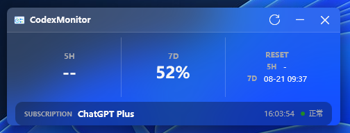

> **Attention**
> CodexMonitor 是个人项目，与 OpenAI 没有任何隶属关系，也没有 OpenAI 官方人员参与。

# CodexMonitor

[English](README.md) · [繁體中文（香港）](README_hk.md)

一个轻量 Windows 工具，通过主窗口、托盘和悬浮窗显示 Codex 额度、重置时间、订阅类型与刷新状态。

版本：`0.3.2`



## 功能

- 显示约 5 小时（`5H`）和 7 天（`7D`）窗口的剩余额度及本地重置时间。
- 启动时读取一次，支持手动刷新和 1～60 分钟自动刷新间隔，默认 3 分钟。
- 读取失败时保留最近成功数据，显示状态并按设置通知。
- 托盘提供恢复窗口、设置、悬浮窗控制及退出入口。
- 悬浮窗可独立选择显示字段、拖动并保存位置；锁定后置顶并支持鼠标穿透，与主窗口共用监控状态。
- 可选择当前用户登录 Windows 后自启，并选择自动启动时最小化到托盘。
- 单实例运行：手动重复启动恢复已有窗口，自动重复启动静默退出。
- 主窗口、设置和托盘支持简体中文、英语及繁体中文（香港），悬浮窗保留英语显示。

Token/API Key 账号的额度与刷新时间显示为 `None`，重置时间显示为 `-`。

## 环境与下载

需要 Windows 10 1809 或更高版本、x64 系统，以及已安装并登录的 Windows 版 Codex。推荐 Windows 11。

| 发布包 | 是否需要另装运行时 |
| --- | --- |
| 自包含单 EXE 或 ZIP | 不需要 |
| 依赖运行时的单 EXE 或 ZIP | 需要 .NET 10 Desktop Runtime x64 |

EXE 文件名规律如下，`<版本号>` 例如 `0.3.2`：

- 自包含版：`CodexMonitor-<版本号>-win-x64-self-contained.exe`
- 依赖运行时版：`CodexMonitor-<版本号>-win-x64-framework-dependent.exe`

ZIP 包命名相同，扩展名改为 `.zip`。

各包功能相同。ZIP 解压后运行 `CodexMonitor.exe`，单 EXE 可直接运行。从源码构建需要 .NET 10 SDK。

已验证的 Codex 版本：

| Codex 版本 | CodexMonitor |
| --- | --- |
| `codex-cli 0.147.0-alpha.6.6` | 0.3.0 |
| `codex-cli 0.155.0-alpha.2.6` | 0.3.1 |
| Codex 桌面版 26.917.51856（`codex-cli 0.155.0-alpha.16`） | 0.3.2 |

Codex 升级可能改变本地 app-server 协议。

## 使用

运行程序后显示主窗口，可手动刷新额度。关闭主窗口后仍在托盘后台运行；左键点击托盘图标恢复窗口，右键打开设置或选择“退出程序”。

在“设置 → 常规 → 界面语言”中选择语言并保存，即时生效；默认使用简体中文。


在托盘菜单或设置中开启悬浮窗。解锁时可拖动，锁定后置顶并让鼠标点击穿透。通过托盘菜单或设置解锁；显示字段与主窗口分别配置。

## 登录 Windows 后自动启动

在“设置 → 常规”中勾选“登录 Windows 后自动启动”并保存。默认关闭，无需管理员权限。

保持“启动后最小化到托盘”勾选时，自动启动仅显示托盘图标，已开启的悬浮窗仍会显示。取消勾选后，自动启动会显示主窗口。普通手动启动始终打开或恢复应用窗口。

只有明确保存自启设置时才会修改启动项。**是否实际启动仍由 Windows 启动应用设置控制**，程序不会恢复在 Windows 设置或任务管理器中禁用的自启。

移动程序后，从新位置运行，在设置中勾选“重新登记当前路径（保存后执行）”并保存。

## 设置与日志

默认位置：

```text
%LOCALAPPDATA%\CodexMonitor\settings.json
%LOCALAPPDATA%\CodexMonitor\logs\codex-monitor.log
```

设置包含自启、通知、刷新间隔和窗口显示内容。旧配置升级时保留原有选项，自启默认关闭。手工编辑 JSON 后需重启；Windows 自启请通过设置窗口开启。

启用系统通知后：

- 关闭主窗口转入后台时，提示“程序仍在通知区域运行”，每次运行期间最多提示一次。
- 额度刷新失败时，提示简短原因，详细信息记录到日志。

`codexExecutable` 可指定 `codex.exe` 路径，通常留空；自动查找优先使用 `%LOCALAPPDATA%\OpenAI\Codex\bin` 中的程序。环境变量 `CODEX_MONITOR_HOME` 可覆盖配置与日志目录。

## 实现与权限

- `CodexMonitor.Core`：模型、显示格式及刷新状态。
- `CodexMonitor.Infrastructure`：Codex 进程通信、JSON 解析、配置、日志和用户自启登记。
- `CodexMonitor.App`：WPF 界面、托盘生命周期、单实例激活和刷新调度。

额度通过本地 `codex.exe app-server` 的标准输入输出读取。每次读取后关闭子进程，最近成功数据保存在内存中。
应用统一调度刷新，主窗口和悬浮窗分别读取同一份监控状态。

程序以普通用户权限运行，认证由 Codex 处理，不直接读取凭据文件或请求令牌内容，忽略账号邮箱字段。日志记录读取结果和错误信息；错误可能包含本机路径，分享前请检查。

自启仅使用当前用户 Windows Run 注册表项中的 `CodexMonitor` 值。

## 构建与测试

在安装 .NET 10 SDK 的 Windows 上运行：

```powershell
dotnet build .\CodexMonitor.sln -c Release
dotnet run --project .\tests\CodexMonitor.Tests\CodexMonitor.Tests.csproj -c Release
```

测试使用模拟启动项存储和临时配置，不修改当前用户真实启动项。WPF 生命周期测试约需一分钟，用于验证真实定时刷新，不显示窗口。项目没有第三方 NuGet 依赖，基本构建使用已安装的 SDK 和桌面目标包。

可选的真实 Codex 读取探针：

```powershell
dotnet run --project .\tests\CodexMonitor.Tests\CodexMonitor.Tests.csproj -c Release -- --live
```

生成四种发布包到 `artifacts/`：

```powershell
powershell.exe -NoProfile -File .\build\Publish.ps1
```

自包含发布可能从 NuGet.org 下载 Microsoft 运行时包。ZIP 包包含三种语言的 README、当前更新记录和许可证。

## 项目信息

额度展示参考了 [CodexQuotaMonitor](https://github.com/DiMY-CN/CodexQuotaMonitor)，轻量 Windows 监视工具的使用方式参考了 [TrafficMonitor](https://github.com/zhongyang219/TrafficMonitor)。

[当前更新记录](CHANGELOG.md) · [完整历史](src/CHANGELOG.md) · [GitHub Releases](https://github.com/LuoIsHere/CodexMonitor/releases)

[MIT 许可证](LICENSE) · Copyright (c) 2026 luoishere

本项目为借助 OpenAI Codex 开发的个人工具，可能存在缺陷，按 MIT 许可证不提供担保。
